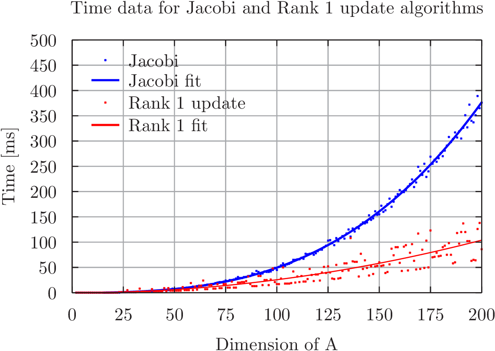

My student number is 201809330, so my project number is 30 mod 23 = 7.

Project number 7 was the "Symmetric rank-1 update of a size-n symmetric eigenvalue problem".
The matrix of interest, *A*, is an $n$ times $n$ matrix constructed from the sum of a diagonal matrix *D*, with elements ${d_1,...,d_n}$ and the outer product of a vector *u* of n random elements with itself multiplied by a factor $\sigma$.

Finding roots of the scalar secular equation given in the eigenvalues chapter of the book (eq. 21),
$$1+\sum_{i=1}^n{\frac{\sigma u^2_i}{d_i - \lambda}} = 0$$,
gives us the n values of $\lambda$ corresponding to the eigenvalues of *A*. The Newton-Raphson method is used for this.

The Jacobi eigenvalue algorithm implemented in the Eigenvalues homework is used to check the found eigenvalues' validity.

After the code has been shown to work, we run through values of n from 2 to 200, plotting the time taken for each value of $n$. These values are plotted with a second-order polynomial fit to see whether we fulfill the $O(n^2)$ requirement. The Jacobi algorithm is plotted with a fit to a third-order polynomial to compare times.

Below is the times plotted as a function of matrix dimension, which we see is in accordance with what we expected:

This part take about 30 seconds in total to run.

The make command also prints out a test-run for $n=8$ of the algorithm to output.txt.
